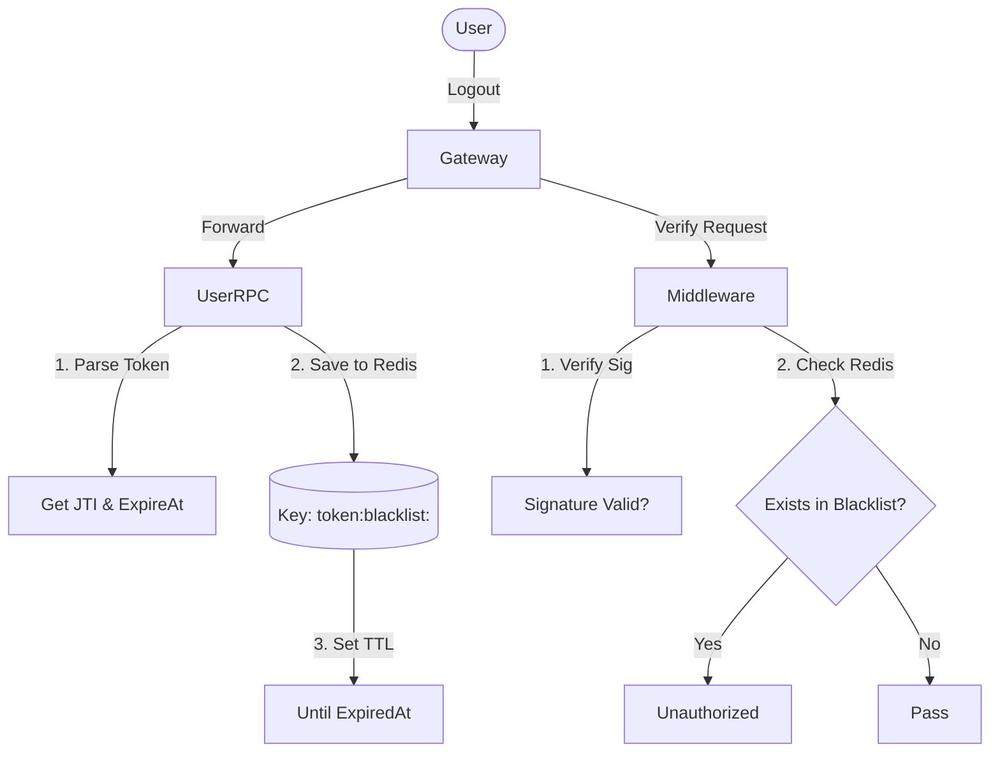

# Phase 1: 用户体系与鉴权闭环构建实战指南

> **文档目标**：本文档详细记录了 FreeExchanged 项目从零开始构建用户微服务（User RPC）和网关（API Gateway）的全过程。通过阅读本文，你将学会如何设计微服务架构、实现 Paseto 鉴权、编写 RPC 与 API 交互逻辑，并完成端到端的联调测试。

---

## 1. 核心设计：我们在做什么？

在 Phase 1 阶段，我们构建了整个系统的基石——**用户身份认证体系**。

### 1.1 架构图解
我们采用了经典的 **Gateway + Microservices** 架构：

```mermaid
graph LR
    Client[客户端/Postman] -->|HTTP 请求| Gateway[API Gateway]
    Gateway -->|1. 拦截鉴权| Middleware[Paseto Middleware]
    Gateway -->|2. 转发请求| UserRPC[User RPC Service]
    UserRPC -->|3. 读写数据| DB[(MySQL)]
    UserRPC -->|4. 缓存/状态| Redis[(Redis)]
    UserRPC -.->|注册服务| Consul[Consul (注册中心)]
    Gateway -.->|发现服务| Consul
```

### 1.2 关键技术选型
*   **框架**: `go-zero` (高性能微服务框架)
*   **协议**: `gRPC` (内部服务通信) + `HTTP` (外部接口)
*   **鉴权**: `PASETO` (Platform-Agnostic Security Tokens) v2，比 JWT 更安全。
*   **注册中心**: `Consul` (用于服务发现，Gateway 自动找到 RPC)。
*   **数据库**: MySQL (持久化) + Redis (缓存/验证码等)。

---

## 2. 实施步骤：我们做了什么？

### Step 1: 基础设施搭建 (Docker)
我们使用 `docker-compose.yml` 启动了核心依赖：
*   **MySQL (3307)**: 存储用户信息。
*   **Redis (6380)**: 用于业务缓存。
*   **Consul (8500)**: 服务注册与发现中心。
*   **Etcd**: (备选，本项目中最终选择了 Consul)。

### Step 2: User RPC 服务开发 (服务端)
这是核心业务逻辑的所在地。

1.  **定义接口 (`desc/user.proto`)**:
    *   定义了 `Login`, `Register`, `UserInfo` 三个核心 RPC 方法。
    *   使用 `goctl rpc ...` 自动生成了代码框架。

2.  **数据模型 (`model/user.sql`)**:
    *   设计了 `user` 表，包含 `mobile`, `password` (加密), `nickname` 等字段。
    *   使用 `goctl model ...` 生成了带有缓存机制的 CRUD 代码。

3.  **核心工具包 (`pkg/`)**:
    *   `pkg/utils/password.go`: 封装了 `bcrypt` 算法，用于密码的加密（Hash）和比对。
    *   `pkg/token/`: 封装了 `Paseto`，用于生成和解析 Token。

4.  **业务逻辑实现 (`internal/logic/`)**:
    *   **RegisterLogic**: 查重 -> 密码加密 -> 写入数据库 -> 生成 Token。
    *   **LoginLogic**: 查用户 -> 比对密码 -> 生成 Token。
    *   **UserInfoLogic**: 根据 ID 查询数据库返回用户详情。

5.  **服务配置 (`etc/user.yaml`)**:
    *   配置了 MySQL、Redis 连接地址。
    *   配置了 `Consul` 注册中心地址。
    *   配置了 `Identity` (Paseto 密钥)。

### Step 3: API Gateway 开发 (网关层)
这是流量的入口，负责路由分发和安全校验。

1.  **定义接口 (`desc/gateway.api`)**:
    *   **Public Group**: `Login`, `Register` (无需登录即可访问)。
    *   **Private Group**: `UserInfo`, `Ping` (需要 `PasetoMiddleware` 鉴权)。

2.  **鉴权中间件 (`internal/middleware/pasetomiddleware.go`)**:
    *   拦截所有受保护请求。
    *   从 Header 解析 `Bearer <token>`。
    *   验证 Token 有效性与 Audience。
    *   **关键动作**: 解析成功后，将 `userId` 注入到 `Request Context` 中，供后续逻辑使用。

3.  **业务逻辑挂载 (`internal/logic/`)**:
    *   Gateway 的 Logic 层非常薄，主要工作是**参数组装**和**调用 RPC**。
    *   例如 `UserInfoLogic`: 从 Context 拿 `userId` -> 调 RPC `UserInfo` -> 返回结果。

4.  **配置关联 (`etc/gateway.yaml`)**:
    *   配置 `UserRpc` 客户端，指定通过 `Consul` 发现服务 (或直连 IP)。
    *   配置与 User 服务完全一致的 `Identity` (密钥)，否则验签会失败。

---

## 3. 踩坑实录：我们学到了什么？

在 Phase 1 开发过程中，我们遇到并解决了几个经典问题，这些经验非常宝贵：

### 3.1 鉴权失败 (401 Unauthorized)
*   **现象**: Postman 请求 `/info` 接口返回 401。
*   **原因**: `User RPC` 生成 Token 时指定 audience 为 `"user"`，但 `Gateway` 验证时且指定 audience 为 `"gateway"`。Paseto 校验不通过。
*   **解决**: 将 Gateway 的 `servicecontext.go` 中验证用的 audience 统一改为 `"user"`。

### 3.2 端口占用
*   **现象**: `bind: Only one usage of each socket address...`
*   **原因**: 旧的 `go run` 进程未正常退出（可能是 Ctrl+Z 挂起而非终止），占用了 8888 端口。
*   **解决**: 使用 PowerShell 查找并强制结束占用端口的进程。

### 3.3 RPC 连接拒绝
*   **现象**: `dial tcp 127.0.0.1:8080: connectex: No connection...`
*   **原因**: Gateway 启动了，但 User RPC 服务没启动（或崩了）。
*   **解决**: 确保 User RPC 先启动并显示 `Starting rpc server...`，再启动 Gateway。

### 3.4 404 Page Not Found
*   **现象**: Postman 请求 `/register` 返回 404。
*   **原因**: 复制粘贴 URL 时，在末尾带入了一个不可见的**换行符 (`%0A`)**。
*   **教训**: URL 要纯净，调试时注意观察日志里的请求路径。

### 3.5 代码生成路径问题 (import cycle / undefined)
*   **原因**: `goctl` 早期生成的文件与新改的 `package` 命名冲突（如 `pb` vs `user`）。
*   **解决**: 清理旧的 `userclient` 代码，统一使用新的 `pb` 包名；删除 Gateway 中旧的 `handler` 残留文件。

---

## 4. 最终成果展示

### 启动命令
```powershell
# 终端 1: 启动 User RPC
go run app/user/cmd/rpc/user.go -f app/user/cmd/rpc/etc/user.yaml

# 终端 2: 启动 API Gateway
go run app/gateway/gateway.go -f app/gateway/etc/gateway.yaml
```

### 测试流程 (Postman)
1.  **注册 (POST /register)**:
    *   输入: `mobile`, `password`, `nickname`
    *   输出: `token` (v2.local...)
2.  **登录 (POST /login)**:
    *   输入: `mobile`, `password`
    *   输出: `token`
3.  **获取信息 (GET /info)**:
    *   Header: `Authorization: Bearer <你的Token>`
    *   输出: 包含 `mobile`, `nickname` 的完整用户信息。

---

---

## 5. 进阶规划：Token 的撤销与注销 (Revocation / Logout)

目前的 Phase 1 实现了 **无状态鉴权** (Stateless Auth)，即 Token 一旦签发，只要签名正确且未过期，就始终有效。这就好比只要发了门票，除非过期，永远无法作废。

在实际生产中，我们需要能够 **主动撤销 Token**（比如用户点"退出登录"、修改密码强制登出、账户封禁等）。为此，我们将引入 **Token 黑名单机制 (Blacklist)**。

### 5.1 架构设计：Token Blacklist
我们利用 **Redis** 来存储已注销的 Token ID (JTI)。



### 5.2 实施步骤 (Phase 1.5)

#### Step 1: 确保 Payload 包含 JTI (Token ID)
检查 `pkg/token/payload.go`，确保 Payload 结构体中包含 `ID` 字段（通常为 UUID）。这是 Token 的唯一身份证。

#### Step 2: User RPC 新增 Logout 接口
*   **Proto**: `rpc Logout(LogoutReq) returns(LogoutResp)`
*   **Logic**:
    1.  接收 Token 字符串。
    2.  解析 Token 得到 `ID` (JTI) 和 `ExpiredAt` (过期时间)。
    3.  计算 Token **剩余有效期** = `ExpiredAt - Now`。
    4.  如果剩余时间 > 0，将 `JTI` 存入 Redis，TTL 设置为剩余时间。
        *   Key: `token:blacklist:<jti>`
        *   Value: `userId` (或者单纯 "1")
    5.  这样 Redis 里只存未过期的无效 Token，过期后 Redis 自动删除，永久有效 Token 自然失效，节省空间。

#### Step 3: Gateway Middleware 改造
目前的中间件只校验了签名和过期时间（无状态校验）。我们需要增加 **有状态校验**：
1.  **VerifyToken** 解析出 Payload，拿到 `ID` (JTI)。
2.  **Check Redis**: 查询 `token:blacklist:<jti>` 是否存在。
    *   **存在** -> 返回 401 Unauthorized (Token 已被注销)。
    *   **不存在** -> 放行。

### 5.3 为什么需要 Redis？
如果不通过数据库/Redis 记录状态，服务器无法得知哪个 Token 是被撤销的。Redis 是做这个的最佳选择：**速度快**（鉴权是高频操作）、**支持 TTL**（自动清理过期黑名单）。

---

