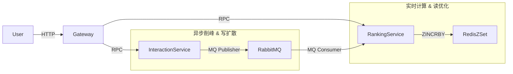

# Phase 2: 互动与排行榜系统核心实现指南 (面试高频点)

本阶段我们完成了从用户点赞到排行榜实时更新的全链路开发。以下是系统架构、核心代码实现及面试关键点解析。

## 1. 架构设计与技术选型

### 1.1 系统架构图


### 1.2 为什么这么设计？(面试题)
*   **Interaction Service**: 将点赞这种高频写操作剥离，避免大量数据库写锁阻塞用户主请求。
*   **RabbitMQ**: 引入消息队列实现**削峰填谷**。即使每秒 10万次点赞，Interaction Service 也能快速返回成功，后续只需由 Ranking Service 慢慢消费更新。
*   **Redis ZSet**: 排行榜是典型的 Top-K 问题，ZSet 底层使用跳表 (SkipList)，插入和查询复杂度均为 O(logN)，非常适合实时排名的场景。

---

## 2. 核心代码实现

### 2.1 Interaction Service (生产者)
核心逻辑：接收请求 -> 发送 MQ 消息 -> 返回成功。
**代码位置**: `app/interaction/cmd/rpc/internal/logic/likelogic.go`

```go
func (l *LikeLogic) Like(in *pb.LikeReq) (*pb.LikeResp, error) {
    // 构造消息体
    msg := LikeMsg{ UserId: in.UserId, ArticleId: in.ArticleId, ... }
    body, _ := json.Marshal(msg)

    // 发送消息到 RabbitMQ (Topic Exchange)
    err := l.svcCtx.MqChannel.Publish(
        "interaction.topic", // Exchange
        "article.like",      // Routing Key
        // ...
        amqp.Publishing{Body: body},
    )
    return &pb.LikeResp{}, nil
}
```
**面试点**: 这里没有直接写数据库，而是发消息，是为了**降低响应延迟** (RT)。

### 2.2 Ranking Service (消费者)
核心逻辑：后台 Goroutine 监听队列 -> 解析消息 -> 更新 Redis ZSet。
**代码位置**: `app/ranking/cmd/rpc/internal/mq/consumer.go`

```go
func Start(c config.Config, rds *redis.Redis) {
    // ... 连接 RabbitMQ ...
    msgs, _ := ch.Consume("ranking.queue", ...)

    go func() {
        for d := range msgs {
            // 解析消息
            var msg LikeMsg
            json.Unmarshal(d.Body, &msg)

            // 原子更新 Redis ZSet (ArticleId 分数 +1)
            rds.Zincrby("hot_articles", 1, fmt.Sprint(msg.ArticleId))
        }
    }()
}
```
**面试点**: 使用 `ZINCRBY` 是原子操作，不用担心并发计数错误。

### 2.3 Ranking Service (查询接口)
核心逻辑：查询 Redis ZRevRange。
**代码位置**: `app/ranking/cmd/rpc/internal/logic/gettoplogic.go`

```go
func (l *GetTopLogic) GetTop(in *pb.GetTopReq) (*pb.GetTopResp, error) {
    // 获取前 N 名 (带分数)
    pairs, _ := l.svcCtx.Redis.ZrevrangeWithScores("hot_articles", 0, int64(in.N-1))
    
    // 组装返回
    var items []*pb.RankItem
    for _, pair := range pairs {
        // ...
    }
    return &pb.GetTopResp{Items: items}, nil
}
```

---

## 3. 最后一步：Gateway 集成 (Step By Step)

现在服务端逻辑通了，我们需要让 Gateway 能够路由请求进来。

### 步骤 1: 修改 Gateway API
在 `desc/gateway.api` 中，我们需要添加两个新的 Handler。

```protobuf
// Interaction
@server(
    group: interaction
    middleware: PasetoMiddleware // 需要登录才能点赞
    prefix: /v1/article
)
service gateway {
    @handler Like
    post /like (LikeReq) returns (LikeResp)
}

// Ranking
@server(
    group: ranking
    prefix: /v1/ranking
)
service gateway {
    @handler GetTop
    get /top (GetTopReq) returns (GetTopResp)
}
```

### 步骤 2: 配置 Gateway YAML
在 `app/gateway/etc/gateway.yaml` 中增加 InteractionRpc 和 RankingRpc 的配置。

### 步骤 3: ServiceContext 初始化
在 `app/gateway/internal/svc/servicecontext.go` 中初始化这两个 RPC Client。

### 步骤 4: 实现 Gateway Logic
调用 RPC 即可。

---

## 4. 面试模拟

**面试官**: 你这个点赞功能，如果同一用户疯狂重复点赞怎么办？
**你**: 
1.  **Gateway 层限流**: go-zero 自带限流中间件。
2.  **业务层去重**: 
    *   方案 A (简单): Interaction Service 在发 MQ 前，先查 Redis Bitmap/Set 判断是否点过。
    *   方案 B (最终一致性): 允许重复发 MQ，但 Consumer 在更新 ZSet 前，先查数据库或 Redis 判断是否已记录。
    *   当前实现：为了演示高性能架构，目前暂时做了全量推送，后续计划加入 Redis Bitmap 去重。

**面试官**: 如果 RabbitMQ 挂了怎么办？
**你**: 
1.  **降级**: Catch 到 Publish 错误，降级为直接写 DB，或者写入本地磁盘/Log，由 Filebeat 采集恢复。
2.  **高可用**: 生产环境会部署 RabbitMQ Cluster (镜像队列)。

**面试官**: 排行榜数据量很大怎么办？
**你**: 
1.  Redis ZSet 单键支持数百万元素。如果过大，可以按时间分片 (hot_articles_202310)，或者只保留 Top 1000 (定时任务裁剪)。
