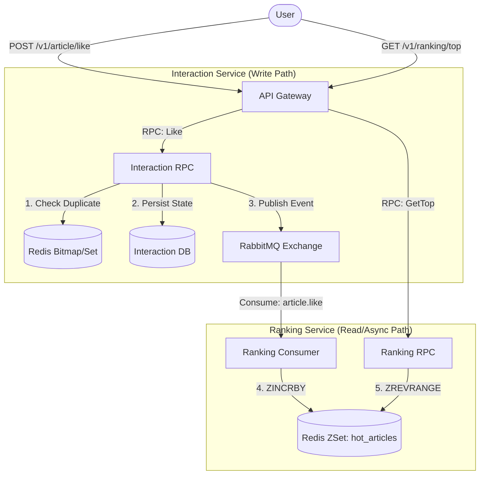

# Phase 2: 互动与排行榜系统 (高并发与异步解耦实战)

> **文档目标**：本文档详细规划了 Phase 2 阶段的开发任务。我们将构建一个基于 **RabbitMQ 消息驱动** 和 **Redis ZSet 实时计算** 的高并发互动与排行榜系统。这一阶段将涵盖点赞、取消点赞、以及热度排行榜的实时更新与查询。

---

## 1. 核心架构设计

在这一阶段，我们将引入两个新的微服务：**Interaction RPC** (互动服务) 和 **Ranking RPC** (排行榜服务)，并集成 **RabbitMQ** 作为削峰填谷的中间件。

### 1.1 架构全景图



### 1.2 关键技术选型
*   **RabbitMQ**: 用于解耦点赞动作与排行榜计算，确保高并发下的写入稳定性。
    *   **Exchange**: `interaction.topic` (Topic 模式)
    *   **RoutingKey**: `article.like`, `article.unlike`
*   **Redis ZSet**: 利用 `Sorted Set` 数据结构实现实时排行榜，Score 为文章热度值。
*   **Redis Bitmap/Set**: 用于去重校验（判断用户是否已点赞），避免刷榜。
*   **MySQL**: 存储点赞记录的持久化数据（`user_likes` 表），用于数据兜底和归档。

---

## 2. 接口设计 (API & Proto)

### 2.1 Interaction RPC (互动服务)
*   **Proto 文件**: `desc/interaction.proto`
*   **Methods**:
    *   `Like(LikeReq) returns (LikeResp)`: 点赞/取消点赞。
*   **Message**:
    ```protobuf
    message LikeReq {
      int64 userId = 1;
      int64 articleId = 2;
      bool cancel = 3; // true=取消点赞, false=点赞
    }
    ```

### 2.2 Ranking RPC (排行榜服务)
*   **Proto 文件**: `desc/ranking.proto`
*   **Methods**:
    *   `GetTop(GetTopReq) returns (GetTopResp)`: 获取前 N 名热度文章。
*   **Message**:
    ```protobuf
    message GetTopReq {
      int32 n = 1; // 获取前几名，例如 10
    }
    message ArticleScore {
      int64 articleId = 1;
      double score = 2;
    }
    ```

### 2.3 Gateway API
*   **API 文件**: `desc/gateway.api` (新增 Interaction/Ranking 组)
*   **Endpoint**:
    *   `POST /v1/article/like`: 调用 Interaction RPC。
    *   `GET /v1/ranking/top`: 调用 Ranking RPC。

---

## 3. 实施步骤

### Step 1: 基础设施检查
*   确保 `docker-compose.yml` 中 RabbitMQ 服务正常运行 (端口 5673/15672)。
*   确保 Redis 服务正常运行。

### Step 2: Interaction Service 开发 (生产者)
1.  **定义 Proto**: 创建 `desc/interaction.proto`。
2.  **生成代码**: `goctl rpc ...`。
3.  **RabbitMQ 集成**:
    *   在 `ServiceContext` 中初始化 RabbitMQ Channel。
    *   实现消息发送逻辑：`Publish("interaction.topic", "article.like", payload)`。
4.  **业务逻辑**:
    *   实现 `LikeLogic`。
    *   校验用户是否点赞 -> 写库 -> 发消息。

### Step 3: Ranking Service 开发 (消费者 & 查询)
1.  **定义 Proto**: 创建 `desc/ranking.proto`。
2.  **生成代码**: `goctl rpc ...`。
3.  **Consumer 实现**:
    *   创建一个后台 Goroutine 或独立 Process。
    *   监听 `interaction.topic`。
    *   收到消息 -> 解析 ArticleId -> `Redis.ZIncrBy("hot_articles", 1, articleId)`。
4.  **查询逻辑**:
    *   实现 `GetTopLogic` -> `Redis.ZRevRangeWithScores`。

### Step 4: Gateway 集成
1.  修改 `gateway.api` 注册新路由。
2.  在 `gateway.yaml` 中配置新的 RPC 客户端 (InteractionRPC, RankingRPC)。
3.  实现 Gateway Logic 调用后端 RPC。

---

## 4. 数据流转示例

**场景：用户 A (ID: 101) 给文章 B (ID: 202) 点赞**

1.  **Gateway**: 收到 `POST /like {article_id: 202}`。解析 Token 得到 `user_id: 101`。
2.  **Interaction RPC**:
    *   查重：Key `user:101:likes` (Set) 是否包含 `202`？ -> 无。
    *   持久化：`INSERT INTO user_likes ...`
    *   **MQ Publish**: Exchange=`interaction.topic`, Key=`article.like`, Body=`{uid:101, aid:202, action:1}`。
    *   Redis Set: `SADD user:101:likes 202`。
    *   返回成功。
3.  **Ranking Consumer**:
    *   监听到消息 `{aid:202, action:1}`。
    *   Redis ZSet: `ZINCRBY hot_articles 1 202`。
4.  **Redis 状态**: `hot_articles`: `[{member: "202", score: 1}]`。
5.  **用户 B 查询榜单**:
    *   `GET /top Redis` -> `ZREVRANGE` -> 返回文章 202 排第一。

---

**Phase 2 核心价值**: 
通过这个架构，你将掌握 **"消息队列解耦写压力"** 和 **"NoSQL 高速读写"** 这两个大厂面试必问的高并发设计模式。我们将实打实地把它们做出来！
