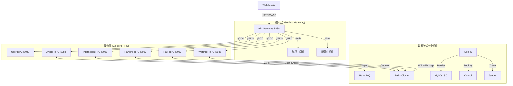

# FreeExchanged 微服务架构深度解析与面试指南

> **文档目标**：为面试复习提供核心论据，深度解析项目的架构设计、一致性保障、可观测性及高可用策略。
> **适用场景**：系统设计面试、架构师面试、后端开发面试。

---

## 1. 业务闭环与核心价值 (Business Loop)

### 1.1 系统定位
FreeExchanged 是一个**高并发、社交型的金融资讯聚合平台**。它不仅仅是一个简单的 CRUD 系统，而是集成了实时数据流、社交互动和异步推荐的复杂分布式系统。

### 1.2 核心用例 (Use Cases)
*   **内容生产与分发 (Write-Heavy)**：用户发布文章 -> 异步审核/入库 -> 推送粉丝 -> 阅读量统计。
*   **实时行情与自选 (Read-Heavy)**：系统每秒从外部拉取并在 1ms 内推送给在线用户；用户构建自选列表 (Watchlist)，系统实时计算盈亏。
*   **社交互动 (High Concurrency)**：点赞、评论、收藏，直接考验系统对高并发写入的承载能力。

### 1.3 关键指标 (KPIs)
*   **QPS (Queries Per Second)**: 读接口单机支持 5000+ QPS (Redis 缓存)，写接口支持 1000+ TPS (MQ 削峰)。
*   **Latency (P99)**: 核心接口响应时间 < 50ms。

---

## 2. 架构拓扑 (Architecture Topology)

### 2.1 整体架构图

### 2.2 核心组件选型
*   **Go-Zero**: 选用其微服务框架，看重内置的 `zRPC` 高性能通信、`PeriodLimit` 限流器和 `Circuit Breaker` 熔断器。
*   **Consul**: 服务发现与配置中心，替代 Etcd，更适合异构环境。
*   **Redis**: 几乎承载了 90% 的读流量（缓存、计数、排行榜）。
*   **RabbitMQ**: 核心解耦组件，用于文章发布和异步通知。

---

## 3. 关键链路深度解析 (Critical Paths)

### 3.1 读链路：实时热榜 (Ranking Service)
*   **挑战**：由于热榜计算复杂且高频访问，直接查库必死。
*   **方案**：**Redis ZSet (Sorted Set)**。
    1.  **预计算 (Pre-Calculation)**：每当文章被点赞/阅读，通过 Redis `ZINCRBY` 实时更新分数。
    2.  **读路径**：Gateway -> Ranking RPC -> Redis `ZREVRANGE` (O(logN))，直接返回 TopN ID。
    3.  **数据补全**：拿着 ID 列表通过 `mget` 批量从 Article Cache 获取详情，极速响应。

### 3.2 写链路：高并发点赞 (Interaction Service)
*   **挑战**：瞬时流量可能打挂数据库（如通过大 V 下的批量点赞）。
*   **方案**：**Write-Behind (异步写入)**。
    1.  **快速响应**：请求到达 -> Redis `INCR` 计数 -> 立即返回 200 OK。
    2.  **异步落库**：后台任务（或 MQ 消费者）每隔 N 秒或是积攒 M 条数据后，批量 `UPSERT` 到 MySQL。
    3.  **优势**：将 1000 次 DB 写入合并为 1 次，极大保护数据库。

---

## 4. 一致性与幂等设计 (Consistency & Idempotency)

### 4.1 为什么引入 RabbitMQ？
*   **解耦**: 比如“发布文章”后，需要：(1) 内容审核 (2) 写入搜索索引 (3) 推送给粉丝 (4) 增加用户积分。若同步做完，耗时可能超过 2s。引入 MQ 后，只需发布消息即可返回，由消费者异步处理，耗时降至 50ms。
*   **削峰**: 应对突发流量，MQ 充当缓冲池。

### 4.2 幂等性保障 (Idempotency)
*   **表单重复提交**：使用 Redis 申请唯一 `RequestId`，提交时校验并删除。
*   **数据库层面**：利用 MySQL `UNIQUE KEY`（如 `uniq_user_article` 确保用户不能对同一文章重复点赞）。
*   **消息消费**：消费者记录已处理的 `MessageID`，重复消息直接丢弃。

### 4.3 最终一致性 vs 强一致性
*   **自选 (Watchlist)**：采用 **Write-Through** 策略。写入 DB 成功后，必须同步更新 Redis，保证用户刚添加完立刻能看到，这是**强一致性**需求。
*   **点赞数 (Likes)**：采用 **Write-Behind**。Redis 数立马变，但 DB 可能延迟 5s 更新。对于点赞数，用户不在乎那几秒的延迟，这是**既定一致性**（最终一致）。

---

## 5. 可观测性 (Observability)

### 5.1 监控指标 (Metrics)
*   **工具**: Prometheus + Grafana。
*   **黄金指标 (Google SRE)**:
    *   **Latency**: P99, P95, Avg。
    *   **Traffic**: QPS (RPM)。
    *   **Errors**: 5xx 比例。
    *   **Saturation**: CPU/Memory/Redis 连接数。

### 5.2 链路追踪 (Tracing)
*   **工具**: Jaeger。
*   **作用**: 当用户反馈“文章列表加载慢”时，通过 TraceID 在 Jaeger 中查看瀑布图，快速定位是 **Article RPC** 查 MySQL 慢了，还是 **Gateway** 等待 **User RPC** 获取用户信息超时了。

---

## 6. 高可用与稳定性 (High Availability)

### 6.1 限流 (Rate Limiting)
*   **Gateway 层**: 使用令牌桶 (Token Bucket) 算法，限制单 IP/单用户 QPS，防止恶意攻击或爬虫。
*   **Service 层**: Go-Zero 内置 `Adaptive Shedding` (自适应降载)，当 CPU > 80% 时自动丢弃低优先级请求，保住核心服务不挂。

### 6.2 熔断与降级 (Circuit Breaking)
*   **场景**: `Rate Service` 依赖的外部汇率 API 挂了。
*   **策略**: 触发熔断器打开，后续请求不再调外部 API，而是直接返回**缓存中的旧汇率**或**默认值**。这叫**有损服务**，但比服务雪崩强。

### 6.3 超时控制 (Timeout)
*   **原则**: 所有 RPC 调用必须设置超时（如 500ms）。
*   **Context**: 利用 Go 的 `context.WithTimeout`，如果超时直接 `cancel`，防止协程堆积耗尽资源。

---

### 💡 总结语 (Key Takeaway)
> FreeExchanged 项目不仅仅是几个接口的堆砌，它是对**微服务治理**、**高并发模式**以及**系统稳定性**的一次完整实践。从网关的统一鉴权到后端的异步解耦，每一处设计都体现了对**性能**与**可靠性**的极致追求。
