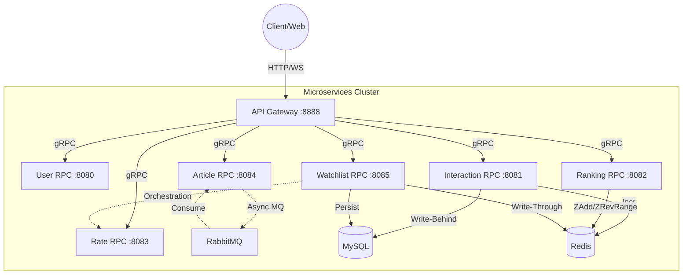

# 微服务架构总览 (Services Overview)

> 本文档汇总了 FreeExchanged 项目的所有微服务、端口、数据库依赖及服务间调用关系。
> 面试时可基于此文档画出架构图。

---

## 1. 服务端口规划 (Port Allocation)

| 服务名称 (Service) | 类型 | 端口 (Port) | Metrics 端口 | 描述 |
|:---|:---|:---|:---|:---|
| **Gateway** | HTTP API | **8888** | 9091 | 统一网关，鉴权，路由分发，WebSocket |
| **User RPC** | gRPC | **8080** | 9090 | 用户注册、登录 (PASETO)、信息管理 |
| **Interaction RPC** | gRPC | **8081** | 9092 | 点赞、收藏、阅读数 (Redis计数) |
| **Ranking RPC** | gRPC | **8082** | 9093 | 排行榜服务 (Redis ZSet) |
| **Rate RPC** | gRPC | **8083** | 9094 | 汇率查询服务 (Cache-Aside) |
| **Article RPC** | gRPC | **8084** | 9096 | 文章发布、列表 (RabbitMQ 异步解耦) |
| **Watchlist RPC** | gRPC | **8085** | 9097 | 自选服务 (Write-Through, Orchestration) |
| **Rate Job** | Process | - | - | 定时任务：每 5min 拉取汇率并写入 DB |

---

## 2. 数据库与中间件依赖 (Infrastructure)

| 组件 | 端口 | 用途 | 依赖该组件的服务 |
|:---|:---|:---|:---|
| **MySQL** | 3307 | 核心业务数据存储 | User, Interaction, Article, Rate, Watchlist |
| **Redis** | 6380 | 缓存、计数器、排行榜、Pub/Sub | All Services (特别是 Ranking, Interaction, Gateway) |
| **RabbitMQ** | 5672 | 异步消息队列 (削峰填谷) | Article (生产), Article (消费) |
| **Etcd** / Consul | 2379 / 8500 | 服务注册与发现 | All RPC Services + Gateway |
| **Prometheus** | 9090 | 监控指标采集 | All Services (暴露 /metrics) |
| **Jaeger** | 16686 | 分布式链路追踪 | All Services (OpenTelemetry) |

---

## 3. 服务调用拓扑 (Service Topology)

---

## 4. 核心功能与技术亮点 (Key Features)

| 模块 | 核心功能 | 技术亮点 (面试关键词) |
|:---|:---|:---|
| **User** | 登录认证 | **PASETO** (比 JWT 更安全), PBKDF2 密码加密 |
| **Interaction** | 点赞/收藏 | **Redis原子计数**, **异步落库** (防止 DB 压力过大) |
| **Ranking** | 热门文章排行 | **Redis ZSet**, **Pipeline** 批量写入, 定时刷新策略 |
| **Article** | 文章发布 | **RabbitMQ** 消息队列解耦, 流量削峰 |
| **Rate** | 汇率查询 | **Cache-Aside** 模式, **Cron Job** 定时同步, 熔断降级 |
| **Watchlist** | 自选行情 | **Write-Through** 缓存一致性, **Service Orchestration** (RPC Fan-out), **Gateway 聚合** |
| **Gateway** | 统一接入 | **WebSocket** 实时推送, **JWT/PASETO 统一鉴权**, 全局限流 (TokenLimit) |

---

## 5. 项目启动顺序 (Startup Sequence)

为了避免依赖报错，建议按以下顺序启动：

1.  **基础设施 (Infrastructure)**:
    *   MySQL, Redis, RabbitMQ, Etcd/Consul, Jaeger, Prometheus
2.  **被依赖的基础服务 (Base Services)**:
    *   User RPC
    *   Rate RPC (被 Watchlist 依赖)
3.  **核心业务服务 (Core Services)**:
    *   Interaction RPC
    *   Article RPC
    *   Ranking RPC
    *   Watchlist RPC
4.  **接口网关 (Gateway)**:
    *   Gateway (最后启动，等待 RPC 就绪)
5.  **后台任务 (Background Jobs)**:
    *   Rate Job (独立运行)

---

## 6. 常用调试命令 (Debug Cheat Sheet)

- **查看 Redis 键值**: `redis-cli -p 6380 keys "*"`
- **查看 RabbitMQ 队列**: `rabbitmqctl list_queues`
- **查看 gRPC 接口列表**: `grpcurl -plaintext localhost:8080 list`
- **Etcd 服务列表**: `etcdctl get --prefix ""`
